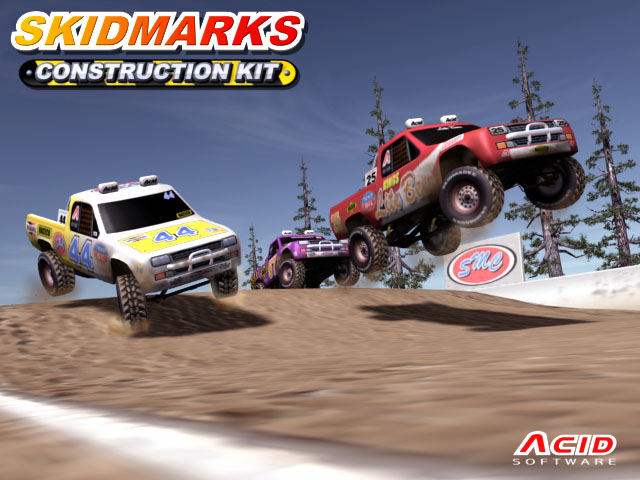

## Welcome to nitrologic

### Recent endeavours

* nitrologic Relay - an AI research tool [Relay 1.8.2 ⛲](https://github.com/nitrologic/relay) 

* [biblispec](https://github.com/nitrologic/biblispec) - language and unicode blocks and music scales of interest

* [vintage kid](https://nitrologic.github.io/vintagekid) - retro TTL electronics project voiding the software apocalypse

* [ali.skid.nz](https://ali.skid.nz/dsptool.html) - lab stack showcase, audio, geo, video, acid32

* celebrating new [AP-SOUTHEAST-6 AWS EC2 region](https://nitrologic.github.io/apacsezone6)

* R3000 emulator - a work in progress javascript worker - [test6-r3000](https://github.com/nitrologic/fountain/blob/main/slop/test6-r3000.slop.js)

* Synth Vicious - audio web worker [vsynth](https://github.com/nitrologic/vsynth)

### Less recent endeavours

* ACID500 - headless virtual Amiga with skidkick vrom [skid30](https://github.com/nitrologic/skid30)

* An archive of various Blitz User media [bbarchives](https://github.com/nitrologic/bbarchives)

* A native OpenGL SDL3 sandbox [plainview](https://github.com/nitrologic/plainview)

* A factory fixture test application for local electronics heavyweights (proprietary)

* A geo tile bakery, server and client experiment  [roagrid](https://github.com/nitrologic/roagrid)

### Thoughts

I dream of big dollar documentation.

## About Me

https://nitrologic.itch.io/

https://www.linkedin.com/in/nitrologic/

Music is music -- Miles Davis
